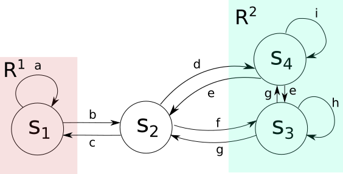

# arcs2tlsf
## Description

This repo contains a simple tool to convert spec and abstraction written in the toolbox [ARCS](https://github.com/pettni/abstr-refinement) into the [TLSF](https://arxiv.org/abs/1604.02284) format.
## Usage
* Download the [ARCS](https://github.com/pettni/abstr-refinement) and add the toolbox folder (and sub-folders) to the search path of MATLAB.
* Build your abstraction using the class `TransSyst` in ARCS.
* Write down your spec in the form of `[]A && <>[]B && (&&_i []<>C_i)`.
* Execute `abstr2TLSF.m` or `abstr2TLSF_brief.m` to convert the spec and the abstraction into the TLSF format:
  * Use `abstr2TLSF.m` for a more readable TLSF file.
  * Use `abstr2TLSF_brief.m` for a more compact TLSF file. It can encode the index of the input and output variable in numerical systems rather than decimal numbers. You need to choose the `compress rate`, which indicates the numerical system used for encoding, e.g. `compress_rate = 2`means that the encoding uses binary number.

## Example

The usage of this tool will be clear by looking through `run_example.m`.

The abstraction built in `run_example.m` is shown as follows:

The spec is A = {s_1,s_2,s_3,s_4}, B = {}, C_1 = {s_1}, C_2 = {s_3,s_4}.
One progress group exists, that is G = {s_3,s_4} under action set U = {e,g}.
